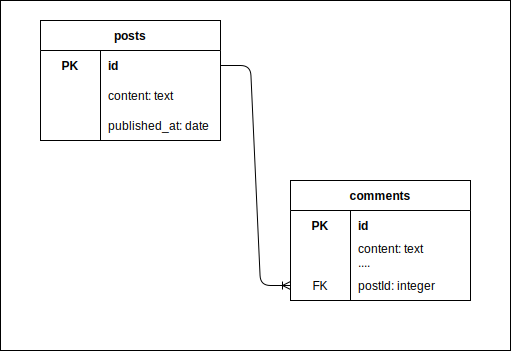

# Day 21: Node + Express Part 4: Understanding Database Relationships: One-to-Many and Many-to-Many Relationships

## Students Will Be Able To (SWBAT)
- Understand the concept of relational databases and their role in web development.
- Define and identify one-to-many and many-to-many relationships in databases.
- Implement these relationships using an ORM (Sequelize).
- Understand how to query and manipulate data in these relationships.

## Agenda
- Introduction to Relational Databases and Their Role in Web Development
- Understanding One-to-Many Relationships
- Understanding Many-to-Many Relationships
- Implementing One-to-Many and Many-to-Many Relationships in Sequelize
- Creating the "notes" Resource (Model, Migration, Database Table, Relationships)
- Creating the "users" Resource (Model, Migration, Database Table, Relationships)
- Querying and Manipulating Data in Sequelize Relationships
- A temporary setup of the /current_user endpoint

### Introduction to Relational Databases and Their Role in Web Development

Relational databases are at the core of many web applications. They allow you to store, query, and manipulate data in a structured and scalable way.

1. **Example 1**: An e-commerce store uses a relational database to keep track of its products, customers, and orders.
2. **Example 2**: A blog website uses a relational database to store the articles, authors, and comments.
3. **Example 3**: A social networking site uses a relational database to store user profiles, posts, likes, and friend relationships.

### Understanding One-to-Many Relationships

In a one-to-many relationship, each record in one table can be associated with one or more records in another table.

1. **Example 1**: A user can have multiple job applications (one-to-many from users to job applications).

2. **Example 2**: A blog post can have many comments (one-to-many from blog posts to comments).

3. **Example 3**: A product can have many orders (one-to-many from products to orders).

You'll notice that in each of these cases, the use of a primary and foreign key relationship is how many rows in the child table can belong to one row in the parent table.  Thus, the foreign key is always on the table for which one row can be associated with **just** one row in the other. The model we say has many of the other is opposite the foreign key.

### Understanding Many-to-Many Relationships

In a many-to-many relationship, multiple records in a table can be associated with multiple records in another table.

1. **Example 1**: A book can have multiple authors, and an author can write multiple books (many-to-many from books to authors).

2. **Example 2**: A student can take multiple courses, and a course can have multiple students (many-to-many from students to courses).

3. **Example 3**: A user can like many posts, and a post can be liked by many users (many-to-many from users to posts).

- You'll notice in all of these cases that there are 3 tables, one of which has two foreign keys and the others which have none. 
- This is necessary because as we said before, we only store foreign keys on a table opposite a one to many relationship. 
- In this case, because we have two tables that need to have multiple associated rows in the opposite table, we need a table in between (called a join table) that will serve to create the relationship between a single row in either table at a time. 
- Each row in the join table establishes a relationship between a single row in each of the adjacent tables that have the many-to-many relationship.

### Implementing One-to-Many and Many-to-Many Relationships in Sequelize

Sequelize provides several methods to define one-to-many and many-to-many relationships.

1. **Example 1**: `hasOne`, `hasMany`, `belongsTo`, and `belongsToMany` are used to set up one-to-many and many-to-many relationships.
2. **Example 2**: `through` option is used to specify a through model in a many-to-many relationship.
3. **Example 3**: `as` option is used to provide an alias for the associated model, which is especially helpful when the same model is associated more than once.

### Creating the "notes" Resource

We will create a "notes" resource, including its model, migration, database table, and relationships.

1. **Example 1**: Defining the "notes" model and setting up its fields.
2. **Example 2**: Generating a migration for the "notes" model and applying it to create the database table.
3. **Example 3**: Setting up the relationship between the "notes" model and other related models (e.g., "users").

### Creating the "users" Resource

Similarly, we will create a "users" resource.

1. **Example 1**: Defining the "users" model and setting up its fields.
2. **Example 2**: Generating a migration for the "users" model and applying it to create the database table.
3. **Example 3**: Setting up the relationship between the "users" model and other related models (e.g., "notes").

### Querying and Manipulating Data in Sequelize Relationships

Once the relationships are set up, we can query and manipulate related data more conveniently.

1. **Example 1**: Fetching a user along with all of his/her notes.
2. **Example 2**: Adding a new note for a specific user.
3. **Example 3**: Updating the notes for a specific job application.

### A Temporary Setup of the /current_user Endpoint

We will temporarily set up a /current_user endpoint to return the first user in the database. We will revisit this endpoint when we implement authentication in the next lesson.

## Key Takeaways

| Concept | Description | Example |
|---------|-------------|---------|
| Relational Databases | They store data in a structured way and allow efficient querying and manipulation. | An e-commerce store uses a relational database to manage products, customers, and orders. |
| One-to-Many Relationships | Each record in one table can be associated with multiple records in another table. | A user can have multiple job applications. |
| Many-to-Many Relationships | Multiple records in one table can be associated with multiple records in another table. | A user can like many posts, and a post can be liked by many users. |
| Sequelize Relationships | Sequelize provides methods to define and work with one-to-many and many-to-many relationships. | `hasOne`, `hasMany`, `belongsTo`, and `belongsToMany` methods in Sequelize. |

## Resources

- [Sequelize Documentation](https://sequelize.org/master/manual/assocs.html)
- [Relational Databases: An Overview](https://www.ibm.com/cloud/learn/relational-databases)
- [Database Relationships: One-to-Many and Many-to-Many](https://www.databaseprimer.com/pages/relationship_1toMany/)
